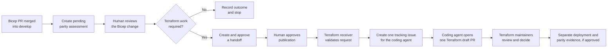
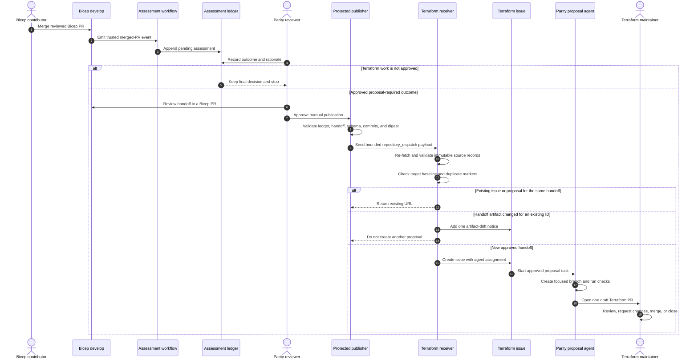

# How Bicep changes become Terraform proposals

This page explains how this repository coordinates updates with
[`Azure/terraform-azurerm-avm-ptn-aiml-landing-zone`](https://github.com/Azure/terraform-azurerm-avm-ptn-aiml-landing-zone).
It is written for contributors, reviewers, and repository administrators.

The process does not copy Bicep code into Terraform. It identifies behavior
that changed in Bicep, records whether Terraform work is required, and, after
human approval, requests a reviewable Terraform draft pull request.

For administrator setup and incident procedures, see
[Terraform parity ownership and operations](./terraform-parity-ownership.md).
For the current capability-by-capability status, see the generated
[Terraform parity inventory](./terraform-parity.md).

## The result in one sentence

Every pull request merged into Bicep `develop` gets one decision record; only a
human-approved decision that requires Terraform work can produce a Terraform
draft pull request.

## High-level workflow

The process has three mandatory human decisions:

1. A reviewer decides whether the Bicep change requires Terraform work.
2. Publication of an approved handoff requires protected-environment approval.
3. Terraform maintainers decide whether to merge the resulting draft PR.

Deployment and parity acceptance are later, separate decisions.

## What parity means here

Parity means that Terraform supports the same approved capability and
observable behavior as Bicep for a named deployment scenario.

Parity is not established by:

- similar source code;
- a successful Bicep compilation;
- a successful `terraform validate`;
- a successful `terraform plan`; or
- a merged implementation pull request.

Runtime parity requires an approved deployment of the relevant Terraform
scenario and a reviewed comparison against the Bicep behavior.

The two scenarios assessed independently are:

- `standalone-standard`;
- `standalone-network-isolated`.

`hub-spoke` is not included unless a later approved handoff explicitly adds it.

## What a parity assessment is

A parity assessment is one JSON record for one Bicep pull request merged into
`develop`. It answers:

> Does this merged Bicep change require an update in the Terraform repository?

The record contains:

- the Bicep pull request number;
- the Bicep merge commit;
- the affected capability IDs;
- the decision;
- the reason for the decision;
- the review status;
- the reviewer and decision URL when approved or rejected; and
- a handoff reference when Terraform work is approved.

The assessment is created with a pending decision. A human reviewer completes
it. The supported outcomes are:

| Outcome | Meaning | Terraform proposal |
| --- | --- | --- |
| `no-terraform-impact` | The Bicep change does not require Terraform work. | No |
| `inventory-update` | The parity inventory must change, but no Terraform implementation is requested yet. | No |
| `proposal-required` | Terraform implementation work is required. | Possible after approval |
| `blocked` | Work is required but a dependency or platform capability prevents it. | No |
| `deferred` | Work is intentionally postponed and the reason is recorded. | No |
| `superseded` | A newer reviewed assessment replaces this record. | No |

Only an assessment with all of these conditions can authorize publication:

- outcome is `proposal-required`;
- outcome and rationale are finalized;
- review status is `approved`;
- reviewer, review URL, and review time are recorded; and
- the referenced handoff is also approved.

Assessments are stored on the dedicated
`terraform-parity-assessments` branch. New records may be appended, but
existing records are not edited or deleted. A later correction is represented
by a new record that supersedes the old record.

## What a handoff is

A handoff is a JSON work order stored in this repository under
`parity/handoffs/`. It tells the Terraform repository what was approved for
proposal work.

A handoff identifies:

- the capability IDs in scope;
- the Bicep and Terraform comparison baselines;
- the assessment or baseline inventory that authorized the work;
- the expected behavior for each standalone scenario;
- compatibility and migration constraints;
- required validation;
- exact exclusions and deferrals; and
- the approval evidence.

A handoff does not contain:

- credentials;
- Azure subscription or tenant identifiers;
- generated Terraform code;
- a source diff to execute; or
- authorization to merge, deploy, or release.

## Detailed workflow

## Step-by-step behavior

### 1. A Bicep change is merged

The process starts only after a pull request is merged into `develop`. It does
not run implementation logic from the pull request branch.

### 2. A pending assessment is appended

`.github/workflows/terraform-parity-assess.yml` uses trusted merge metadata to
call `scripts/parity/New-AlignmentAssessment.ps1`. The new JSON record is
written only to the ledger branch.

The workflow does not decide whether Terraform work is required.

### 3. A human records the decision

A parity reviewer examines the merged Bicep behavior and selects one outcome.
The reviewer records a rationale that explains the decision.

The decision is not an approval to publish. Approval or rejection is a
separate review state with named evidence.

### 4. Approved Terraform work gets a handoff

For a `proposal-required` outcome, contributors create a handoff with
`scripts/parity/New-TerraformHandoff.ps1`. The handoff is reviewed in this
repository and linked to the approved assessment.

### 5. Publication is manual

An operator starts `.github/workflows/terraform-parity-publish.yml` with the
approved handoff path. The job pauses at the protected
`terraform-parity-publication` environment until its required reviewers
approve it.

Before sending anything, the publisher verifies:

- the selected assessment from the protected ledger;
- the handoff approval;
- allowed source and target repositories and branches;
- the committed handoff and schema bytes;
- the handoff digest;
- comparison baselines;
- capability IDs; and
- payload size and allowed fields.

### 6. The Terraform repository validates the request again

The target workflow does not trust the dispatch payload by itself. Its receiver
fetches the handoff and schema from the exact Bicep commit named by the request,
then repeats the contract, approval, digest, provenance, and baseline checks.

The target repository never checks out or executes Bicep repository code.

### 7. Duplicate work is prevented

The receiver searches existing Terraform pull requests and issues for the
`handoffId`.

- Same ID and same handoff commit: return the existing URL.
- Same ID and different handoff commit: report drift once and stop.
- New ID: create one tracking issue.

### 8. The coding agent prepares a draft PR

The tracking issue assigns the target repository's
`.github/agents/parity-proposal.agent.md` custom agent. The issue records the
exact Terraform `main` commit from which the proposal must branch.

The agent may:

- read the approved handoff;
- implement only the approved scope;
- update tests and directly related documentation;
- run Terraform and AVM validation; and
- open one draft PR.

The agent may not merge, deploy, release, configure credentials, modify this
Bicep repository, or claim parity.

### 9. Terraform maintainers decide

Terraform maintainers review the draft PR normally. They may request changes,
merge it, or close it.

A merge closes implementation work only. Runtime parity still requires
separately approved deployment and comparison evidence.

## How the repository files support the process

### Bicep repository

| Path | Purpose |
| --- | --- |
| `parity/inventory.json` | Lists capabilities, Bicep and Terraform support status, gaps, scenarios, owners, and evidence. |
| `docs/terraform-parity.md` | Generated human-readable view of the inventory. |
| `parity/assessments/` | Contains the reviewed adoption seed; ongoing records live at the same path on the ledger branch. |
| `parity/handoffs/` | Contains structured, reviewable work orders for Terraform proposals. |
| `parity/schemas/` | Defines the allowed JSON structure for inventory, assessments, handoffs, and evidence. |
| `scripts/parity/New-AlignmentAssessment.ps1` | Creates one pending assessment from trusted merged-PR metadata. |
| `scripts/parity/Set-AlignmentAssessment.ps1` | Records the human outcome, rationale, and approval or rejection evidence. |
| `scripts/parity/New-TerraformHandoff.ps1` | Creates a handoff from an approved assessment or reviewed baseline inventory. |
| `scripts/parity/Publish-TerraformHandoff.ps1` | Validates and produces the bounded dispatch payload. |
| `scripts/parity/Test-ParityAssets.ps1` | Checks schemas, references, approvals, baselines, duplicate IDs, and sensitive content. |
| `scripts/parity/Test-AssessmentCoverage.ps1` | Proves that every in-scope merged Bicep PR has exactly one assessment. |
| `scripts/parity/Test-LedgerAppendOnly.ps1` | Rejects changes to existing ledger records and paths outside the assessment directory. |
| `.github/workflows/terraform-parity-assess.yml` | Appends a pending assessment after an eligible Bicep merge. |
| `.github/workflows/terraform-parity-publish.yml` | Performs human-gated cross-repository publication. |
| `.github/workflows/terraform-parity-validate.yml` | Validates contracts, generated documentation, tests, and ledger coverage. |
| `tests/parity/` | Tests record transitions, workflow security, publication, idempotency, coverage, and end-to-end behavior. |

### Terraform repository

| Path | Purpose |
| --- | --- |
| `.github/workflows/parity-proposal.yml` | Accepts only the parity dispatch event and runs the trusted receiver with bounded permissions. |
| `.github/scripts/parity_proposal.py` | Re-validates the source records, checks target history, prevents duplicates, reports drift, and creates the tracking issue. |
| `.github/agents/parity-proposal.agent.md` | Restricts the coding agent to the approved handoff and one draft PR. |
| `tests/parity_proposal/test_parity_proposal.py` | Tests validation, security, idempotency, drift, and issue instructions. |
| `docs/parity-proposal.md` | Documents the target-side contract and activation boundaries. |

## Why several commit SHAs are required

The process records different commits because they identify different facts:

| Value | What it identifies |
| --- | --- |
| `sourceCommitSha` | Bicep implementation used as the comparison baseline. |
| `targetCommitSha` | Terraform implementation used as the historical comparison baseline. |
| `handoffCommitSha` | Commit containing the exact approved handoff and its schema. |
| `inventoryCommitSha` | Commit containing the exact reviewed inventory, when inventory provenance is used. |
| Current Terraform `main` head | Branch point for the new proposal, observed by the receiver when it runs. |

The receiver must not use one value in place of another. A historical Bicep
implementation commit may predate the handoff files, and the historical
Terraform baseline normally differs from current `main`.

## Security and authorization boundaries

- Bicep `develop` must accept changes only through reviewed pull requests.
- The assessment ledger must forbid force pushes, deletion, and edits to old
  records.
- Publication is manual and protected by required reviewers.
- The GitHub App is installed only on the Terraform repository and receives
  only the minimum permissions required for `repository_dispatch`.
- App credentials are environment secrets, not repository-wide secrets.
- The publisher sends identifiers and immutable references, not credentials or
  executable source.
- The Terraform receiver uses its checked-in code and fetches source records as
  data.
- Neither workflow can merge a PR or deploy Azure resources.

## Required setup before activation

Do not activate the process until all of these are true:

1. The three Bicep parity workflows are present on the repository's default
   branch. This is required because GitHub loads `pull_request_target`
   workflows from the default branch.
2. `develop` has the documented pull-request and history protections.
3. `terraform-parity-assessments` exists, contains the reviewed adoption seed,
   and has append-only protection.
4. The `terraform-parity-publication` environment exists with the required
   Bicep and Terraform reviewers.
5. The narrowly scoped GitHub App is installed only on the Terraform
   repository.
6. `PARITY_DISPATCH_APP_ID` and
   `PARITY_DISPATCH_APP_PRIVATE_KEY` exist only in the protected environment.
7. The compatible Terraform receiver has been reviewed and merged.
8. Administrators approve the first assessment and dispatch exercise.

If any prerequisite is missing, the process must remain disabled.

## What remains manual

The process intentionally does not automate:

- deciding whether Terraform work is required;
- approving an assessment;
- reviewing and approving a handoff;
- approving publication;
- reviewing or merging the Terraform draft PR;
- recording the proposal URL back in the Bicep repository;
- running `terraform apply`;
- creating or deleting Azure resources;
- publishing a release; or
- declaring runtime parity.

## Failure behavior

The process fails without creating new work when:

- a payload is missing fields or contains unknown fields;
- a repository, branch, path, commit, or capability is not allowed;
- a handoff or assessment is not approved;
- committed bytes do not match the supplied digest;
- the handoff fails its schema;
- a comparison baseline does not resolve;
- the Terraform baseline is not in current `main` history;
- the ledger is missing or inconsistent after activation;
- an existing `handoffId` refers to different artifact bytes; or
- required GitHub permissions or protected configuration are unavailable.

Failures do not fall back to unreviewed data and do not create a second
proposal.

## Common questions

### Does every Bicep merge create a Terraform PR?

No. Every eligible Bicep merge creates an assessment. A Terraform proposal is
possible only when a human approves a `proposal-required` assessment and its
handoff.

### Does the automation translate Bicep syntax into Terraform syntax?

No. The handoff describes approved behavior and constraints. The coding agent
implements that behavior using the Terraform repository's conventions and
tests.

### Can the process merge or deploy?

No. It can create an assessment, publish an approved request, create a tracking
issue, and request a draft PR. Merge and deployment require separate human
actions.

### Is a merged Terraform PR proof of parity?

No. Runtime parity requires approved deployment evidence for each applicable
standalone scenario and a reviewed comparison.

### What happens when the same request is delivered twice?

The receiver returns the existing issue or draft PR. It does not create a
duplicate.

### What happens when approved handoff content changes?

The changed content must exist at a new immutable commit. If the same handoff
ID already has an issue or proposal, the receiver reports artifact drift and
does not create another proposal. A reviewer must resolve the mismatch.

### Can an old assessment be edited?

No. The ledger is append-only. A correction is represented by a new record
that supersedes the previous record.

## Related documents

- [Terraform parity inventory](./terraform-parity.md)
- [Terraform parity ownership and operations](./terraform-parity-ownership.md)
- [ADR-0003: Repository-native Terraform parity coordination](./adr/0003-repository-native-terraform-parity-coordination.md)
- [ADR-0004: Parity dispatch artifact commit contract](./adr/0004-parity-dispatch-artifact-commit-contract.md)
- [Terraform receiver documentation](https://github.com/Azure/terraform-azurerm-avm-ptn-aiml-landing-zone/blob/main/docs/parity-proposal.md)

