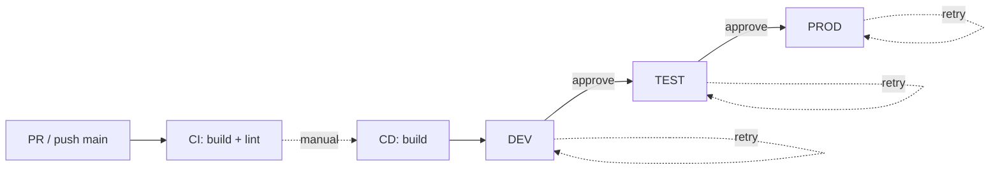
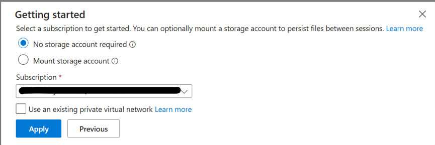
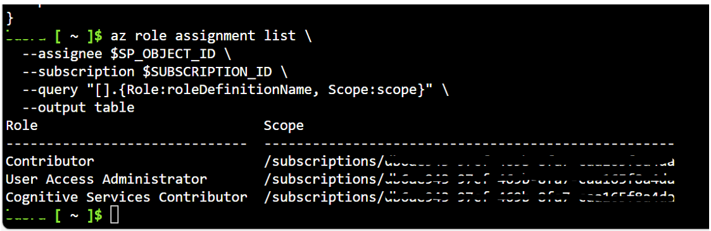

# Deploy with Azure DevOps

CI/CD pipelines for deploying the Azure AI Landing Zone Bicep infrastructure via Azure DevOps. Uses Azure Developer CLI (`azd`) for provisioning, matching the upstream repo's recommended deployment flow.

**Quick Start**

1. Complete the [Azure Setup Guide](#azure-setup-guide) (Steps 1–6)
2. Follow the [Pipeline Usage Guide](#pipeline-usage-guide) (Steps 7–10)
3. See [Maintenance and Troubleshooting](#maintenance-and-troubleshooting) for ongoing operations

**Pipeline Files**

| File | Purpose |
|------|---------|
| `ci-pipeline.yml` | CI – Bicep compile, lint, and publish artifact on every PR and push to `main` |
| `cd-pipeline.yml` | CD – Manual, sequential deployment: DEV → TEST → PROD (with approval gates configured on Environments) |
| `templates/variables.yml` | Shared variables (per-env service connection, location, environment name, retry count) |
| `templates/validate-bicep.yml` | Reusable job: Bicep build + lint + publish artifact |
| `templates/deploy-bicep.yml` | Reusable deployment job using `azd provision` with built-in retry loop |
| `templates/preview-bicep.yml` | (Unused, retained for future) Reusable job for `azd provision --preview` |
| `tools/azure_region_capacity_checker.ps1` | Shared local helper to rank Azure regions by service support, VM SKU, vCPU, AI Search and Cognitive quota |
| `tools/check-resource-providers.ps1` | Optional shared helper to verify (and optionally register) the Azure resource providers required by `main.bicep` |

**Prerequisites**

- Azure DevOps organization with a project containing a Git repository
- One Azure subscription per environment (DEV/TEST/PROD can share or differ); deploying identity needs **Owner**, or **Contributor** + **User Access Administrator** + **Cognitive Services Contributor**
- **Project Administrator** or **Build Administrator** role in Azure DevOps
- Parallel job grant ([request here](https://aka.ms/azpipelines-parallelism-request)) or self-hosted agent
- Azure CLI and Azure Developer CLI (`azd`) installed locally

**Optional — Region Capacity Check**

AI Landing Zone deploys resources such as Virtual Machines, Cosmos DB, AI Services, and Container Apps that are subject to **regional quota and availability constraints**. Deploying to a region with insufficient capacity can cause provisioning failures.

Before starting your deployment, verify that the target region is configured in `templates/variables.yml` (`location` variable). To help you choose the right region, run the capacity checker script included in this repository:

```powershell
az login
./tools/azure_region_capacity_checker.ps1
```

The script checks VM SKU availability, compute vCPU quota headroom, Cosmos DB availability zone support, Azure AI Search SKU quota/capability, and AI service registration across candidate regions, then ranks them by overall readiness.

!!! tip
    The script accepts optional parameters such as `-VmSku`, `-Regions`, `-Top`, and `-OutputFormat`. Run `Get-Help ./tools/azure_region_capacity_checker.ps1 -Detailed` for the full parameter list.

After reviewing the output, update the `location` variable in `templates/variables.yml` (or run `azd env set AZURE_LOCATION <region>` for `azd`-based deployments) before provisioning.

**Pipeline Architecture**



- Each env stage runs only when its `deploy<Env>` boolean is set to `true` at queue time (all default to `false`).
- Stages are chained: `Test.dependsOn = Dev`, `Prod.dependsOn = Test`. A failed env skips all later envs.
- `azd provision` retries on transient Azure failures; controlled by `deployRetryCount` in `templates/variables.yml` (default `2`, set to `0` to disable).
- Approvals are configured on Azure DevOps **Environments** (outside YAML), not in the pipeline file.


## Azure Setup Guide

Step-by-step Azure and Azure DevOps configuration required before running the CI/CD pipelines.

> **Documentation sources verified**: This guide is based on the official
> Microsoft Learn documentation as of March 2026.
> - [Manage service connections](https://learn.microsoft.com/en-us/azure/devops/pipelines/library/service-endpoints?view=azure-devops&tabs=yaml)
> - [Connect to Azure with ARM service connection](https://learn.microsoft.com/en-us/azure/devops/pipelines/library/connect-to-azure?view=azure-devops)
> - [Create and target environments](https://learn.microsoft.com/en-us/azure/devops/pipelines/process/environments?view=azure-devops)
> - [Define approvals and checks](https://learn.microsoft.com/en-us/azure/devops/pipelines/process/approvals?view=azure-devops&tabs=check-pass)
> - [Manage variable groups](https://learn.microsoft.com/en-us/azure/devops/pipelines/library/variable-groups?view=azure-devops&tabs=yaml)

---


### 1. Service Connections

The pipelines target up to three environments — DEV, TEST, PROD — each with its own ARM service connection. The connections may point to the same subscription or to different subscriptions.

**1.1 Create the Connections**

Repeat the steps below **once per environment** you plan to deploy to (you can create only DEV first and add the others later).

Choose **one** option per connection based on your organization's policies:

**Option A: App Registration with Workload Identity Federation (Recommended)**

Use this option if your organization allows creating app registrations.

1. In your Azure DevOps project, go to **Project settings** (gear icon, bottom-left).
2. In the left menu under **Pipelines**, select **Service connections**.
3. Select **Create/New service connection**.
4. Select **Azure Resource Manager**, then select **Next**.
5. Select **App registration (automatic)** with credential type **Workload identity federation**.
6. Configure the connection:
    - **Scope level**: `Subscription`
    - **Subscription**: Select the target Azure subscription for this environment
    - **Resource group**: Leave empty (subscription-level access needed)
    - **Service connection name**: e.g. `azure-ailz-dev`, `azure-ailz-test`, `azure-ailz-prod`
    - **Description**: `AI Landing Zone Bicep deployment — <env>`
7. **Do NOT** check "Grant access permission to all pipelines" — you will authorize each pipeline individually (more secure).
8. Select **Save**.

**Option B: Managed Identity**

Use this option if your organization restricts app registrations (e.g., via Azure AD policy).

1. Ensure you have an existing **user-assigned managed identity** in the target Azure subscription.
2. In your Azure DevOps project, go to **Project settings** → **Service connections**.
3. Select **New service connection** → **Azure Resource Manager** → **Next**.
4. Select **Managed identity**.
5. Configure the connection:
    - **Subscription**: Select your target Azure subscription for this environment
    - **Resource group**: The resource group containing your managed identity
    - **Managed identity**: Select the existing user-assigned managed identity
    - **Service connection name**: e.g. `azure-ailz-dev`, `azure-ailz-test`, `azure-ailz-prod`
6. Select **Save**.

!!! info "Reference"
    [Create a service connection for a managed identity](https://learn.microsoft.com/en-us/azure/devops/pipelines/library/connect-to-azure?view=azure-devops#create-a-service-connection-for-an-existing-user-assigned-managed-identity)

!!! note
    Whatever you name the connections, you will record those names later in `pipelines/azuredevops/templates/variables.yml` under `azureServiceConnectionDev`, `azureServiceConnectionTest`, and `azureServiceConnectionProd` (Step 6).

**1.2 Verify the Connection**

1. Go to **Project settings** → **Service connections** → select each connection.
2. On the **Overview** tab, confirm the connection type shows **Azure Resource Manager** with the credential type you chose.

---

### 2. RBAC Role Assignments

Each service principal that backs your service connections needs specific Azure roles. The AI Landing Zone template creates resources **and** assigns RBAC roles to managed identities, which requires elevated permissions.

!!! note
    Repeat the steps below **once per service connection** you created in Step 1, against the corresponding subscription.

**Required Roles**

| Role | Scope | Why |
|------|-------|-----|
| **Contributor** | Subscription | Create and update all Azure resources |
| **User Access Administrator** | Subscription | Assign RBAC roles to managed identities created by the template |
| **Cognitive Services Contributor** | Subscription | Deploy AI Foundry accounts and OpenAI model deployments |

**Find Your Service Principal's Application ID**

1. In Azure DevOps, go to **Project settings** → **Service connections**.
2. Select the service connection you want to grant roles to (e.g., `azure-ailz-dev`).
3. Select **Manage App registration** (link at the top of the Overview tab) — this opens the Azure Portal.
4. On the **App registration** overview page, copy the **Application (client) ID** (a GUID like `xxxxxxxx-xxxx-xxxx-xxxx-xxxxxxxxxxxx`).
5. Also note the **Subscription ID** that connection targets — visible on the service connection details page or in **Subscriptions** in the Azure Portal.

**Assign Roles via Azure Cloud Shell**

1. Go to the **Azure Portal** → select the **Cloud Shell** icon (terminal icon `>_` in the top navigation bar).
2. If prompted with "Welcome to Azure Cloud Shell", select **Bash**.
3. If this is your first time using Cloud Shell, a **"Getting started"** dialog will appear:
    - Select **No storage account required**.
    - Choose your **Subscription** from the dropdown.
    - Select **Apply** and wait for the terminal to initialize.

    

4. Run the following commands in Cloud Shell (replace the two placeholder values):

```bash
# ── Replace these with your actual values ─────────────────────────────
SP_APP_ID="<paste-your-application-client-id-here>"
SUBSCRIPTION_ID="<paste-your-subscription-id-here>"
# ──────────────────────────────────────────────────────────────────────

# Set the active subscription
az account set --subscription $SUBSCRIPTION_ID

# Get the service principal object ID from the application ID
SP_OBJECT_ID=$(az ad sp show --id $SP_APP_ID --query id -o tsv)
echo "Service Principal Object ID: $SP_OBJECT_ID"

# Assign Contributor
az role assignment create \
  --assignee-object-id $SP_OBJECT_ID \
  --assignee-principal-type ServicePrincipal \
  --role "Contributor" \
  --scope "/subscriptions/$SUBSCRIPTION_ID"

# Assign User Access Administrator
az role assignment create \
  --assignee-object-id $SP_OBJECT_ID \
  --assignee-principal-type ServicePrincipal \
  --role "User Access Administrator" \
  --scope "/subscriptions/$SUBSCRIPTION_ID"

# Assign Cognitive Services Contributor
az role assignment create \
  --assignee-object-id $SP_OBJECT_ID \
  --assignee-principal-type ServicePrincipal \
  --role "Cognitive Services Contributor" \
  --scope "/subscriptions/$SUBSCRIPTION_ID"
```

5. Verify the assignments were created successfully:

```bash
az role assignment list \
  --assignee $SP_OBJECT_ID \
  --subscription $SUBSCRIPTION_ID \
  --query "[].{Role:roleDefinitionName, Scope:scope}" \
  --output table
```

You should see output similar to:



**Alternative: Assign Roles via Azure Portal UI**

If you prefer the portal UI instead of CLI:

1. Go to **Subscriptions** → select your subscription → **Access control (IAM)**.
2. Select **+ Add** → **Add role assignment**.
3. On the **Role** tab, search for `Contributor` and select it → **Next**.
4. On the **Members** tab, select **User, group, or service principal** → **+ Select members**.
5. Search for the app registration name (shown in your service connection) → select it → **Select**.
6. Select **Review + assign** → **Review + assign**.
7. Repeat for `User Access Administrator` and `Cognitive Services Contributor`.

!!! warning "Security note"
    If your organization requires narrower scoping, create one resource group per environment and assign roles at that scope. You'll need to pre-create the resource groups in that case.

---

### 3. DevOps Environments

Azure DevOps Environments provide deployment history, traceability, and approval gates. The CD pipeline targets three environments: `dev`, `test`, and `prod`.

!!! warning "Important"
    You must create the environments **before** running the CD pipeline. If an environment doesn't exist and the pipeline is triggered by a push (not the web editor), the pipeline will fail with: *"Environment could not be found."*

**Create Each Environment**

Repeat the following for environments named: `dev`, `test`, `prod`.

1. In your Azure DevOps project, go to **Pipelines** → **Environments** in the left menu.
2. Select **Create environment** (or **+ New environment** if environments already exist).
3. Fill in:
    - **Name**: `dev` (then `test`, then `prod`)
    - **Description**: `AI Landing Zone - DEV environment` (adjust per environment)
    - **Resource**: Select **None** (we are not adding Kubernetes or VM resources)
4. Select **Create**.

After creating all three, you should see:

| Environment | Description |
|-------------|-------------|
| `dev` | Development — manual opt-in via the `deployDev` parameter; no approval by default |
| `test` | Test/QA — manual opt-in via `deployTest`; recommended to add an approval check |
| `prod` | Production — manual opt-in via `deployProd`; recommended to add an approval check |

---

### 4. Approval Checks

**(Optional but Recommended)**

Approval checks ensure that deployments to `test` and `prod` require manual sign-off before proceeding. The pipeline does not enforce them in YAML — you configure them on the Environment resource.

**Add Approvals to the `test` Environment**

1. In **Pipelines** → **Environments**, select the **test** environment.
2. Select the **Approvals and checks** tab (or click the three dots menu → **Approvals and checks**).
3. Select the **+** button to add a new check.
4. Select **Approvals**, then select **Next**.
5. Configure:
    - **Approvers**: Add one or more users or groups who can approve deployments to Test.
    - **Instructions to approvers**: `Please review the previous DEV run and confirm deployment to TEST.`
    - **Allow approvers to approve their own runs**: Uncheck for production-grade security (optional for test).
    - **Timeout**: `72 hours` (the stage will be marked as skipped if not approved within this time).
6. Select **Create**.

**Add Approvals to the `prod` Environment**

Repeat the same steps for the `prod` environment with stricter settings:

1. Select the **prod** environment → **Approvals and checks** tab → **+**.
2. Select **Approvals** → **Next**.
3. Configure:
    - **Approvers**: Add senior engineers or a release management group.
    - **Instructions**: `PRODUCTION deployment. Verify TEST environment is healthy before approving.`
    - **Allow approvers to approve their own runs**: **Uncheck** (recommended for production).
    - **Timeout**: `72 hours`.
4. Select **Create**.

**(Optional) Add Branch Control to `prod`**

To ensure only the `main` branch can deploy to production:

1. On the `prod` environment → **Approvals and checks** tab → **Add new**.
2. Select **Branch control**.
3. Set **Allowed branches**: `refs/heads/main`.
4. Check **Verify branch protection** if your repo has branch policies.
5. Select **Create**.

---

### 5. Variable Group

The CD pipeline expects a variable group named `ailz-secrets` that stores the VM admin password and any other secrets.

**Create the Variable Group**

1. In your Azure DevOps project, go to **Pipelines** → **Library** in the left menu.
2. Select **+ Variable group**.
3. Fill in:
    - **Variable group name**: `ailz-secrets`
    - **Description**: `Secrets for AI Landing Zone deployments`
4. Under **Variables**, select **+ Add** and create:

    | Name | Value | Secret? |
    |------|-------|---------|
    | `secretOrRandomPassword` | `<your-secure-password>` | Yes — click the lock icon 🔒 |

    !!! tip "Password requirements"
        The VM admin password must meet Azure complexity requirements — at least 12 characters, with uppercase, lowercase, numbers, and special characters.

5. Select **Save**.

!!! note
    You will authorize specific pipelines to use this variable group later, after the pipelines are created.

---

### 6. Pipeline Variables

Before creating pipelines, update the shared variables to match your Azure environment.

**Edit `pipelines/azuredevops/templates/variables.yml`**

Open the file and update these values:

```yaml
variables:
  # ── Azure connection (one per env) ─────────────────────────────────
  azureServiceConnectionDev:  'azure-ailz-dev'    # Must match Step 1
  azureServiceConnectionTest: 'azure-ailz-test'
  azureServiceConnectionProd: 'azure-ailz-prod'

  # ── Azure region (shared across envs) ──────────────────────────────
  location: 'eastus2'                              # Your preferred Azure region

  # ── AZD environment name (suffixed with -dev/-test/-prod per stage) ──
  environmentName: 'ailz'

  # ── Deployment mode ────────────────────────────────────────────────
  deploymentMode: 'zeroTrust'                      # 'basic' for public networking

  # ── Deploy retries ─────────────────────────────────────────────────
  deployRetryCount: 2                              # 0 disables retries
```

!!! note
    Resource group names and parameter file paths are not pipeline variables — the Azure Developer CLI (`azd`) handles resource group creation and parameter resolution automatically based on `azure.yaml` and `main.parameters.json`. The CD pipeline derives each env's resource group as `rg-<environmentName>-<env>` (e.g., `rg-ailz-dev`).

**Per-Environment Overrides**

If an env needs extra `azd` env variables, set them per stage in `pipelines/azuredevops/cd-pipeline.yml` via the `additionalEnvVars` template parameter:

```yaml
- template: templates/deploy-bicep.yml
  parameters:
    azureServiceConnection: $(azureServiceConnectionDev)
    location: $(location)
    environmentName: dev
    azdEnvironmentName: $(environmentName)-dev
    additionalEnvVars: 'USE_UAI=true USE_CAPP_API_KEY=false'
```

## Pipeline Usage Guide

How to register, authorize, run, and customize the CI/CD pipelines.

### 7. CI Pipeline

1. In your Azure DevOps project, go to **Pipelines** in the left menu.
2. Select **New pipeline** (or **Create pipeline** if this is the first pipeline).
3. On the **"Where is your code?"** screen, select **Azure DevOps/Azure Repos Git**.
4. Select the **ailz** repository.
5. On the **"Configure your pipeline"** screen, select **Existing Azure Pipelines YAML file**.
6. In the dialog:
    - **Branch**: `main`
    - **Path**: select `pipelines/azuredevops/ci-pipeline.yml` from the dropdown.
7. Select **Continue**.
8. Review the YAML — do **not** change it. Select **Save** (use the dropdown arrow next to "Run" → **Save** if you want to save without running yet).
9. **(Recommended)** Rename the pipeline:
    - Go to the pipeline you just created.
    - Select the **⋮** (More actions) menu → **Rename/move**.
    - Rename to: `AI Landing Zone - CI`.

---

### 8. CD Pipeline

1. Go to **Pipelines** → **New pipeline**.
2. Select **Azure Repos Git** → select the **ailz** repository.
3. Select **Existing Azure Pipelines YAML file**.
4. In the dialog:
    - **Branch**: `main`
    - **Path**: select `pipelines/azuredevops/cd-pipeline.yml`.
5. Select **Continue**.
6. Review the YAML. Select **Save** (not Run — you should authorize permissions first).
7. Rename the pipeline to: `AI Landing Zone - CD`.

---

### 9. Pipeline Permissions

Now that both pipelines exist, authorize them to use the service connections and variable group.

**Authorize the Service Connections**

Repeat the following for each service connection you created in Step 1 (e.g., `azure-ailz-dev`, `azure-ailz-test`, `azure-ailz-prod`):

1. Go to **Project settings** → **Service connections**.
2. Select the connection.
3. Select the **⋮** (More actions) → **Security**.
4. Under **Pipeline permissions**, select **+**.
5. Add the `AI Landing Zone - CD` pipeline. (CI doesn't need any service connection.)

**Alternative**: When you first run the CD pipeline, Azure DevOps shows: *"This pipeline needs permission to access a resource before this run can continue."* Select **View** → **Permit** → **Permit** to authorize on-demand.

**Authorize the Variable Group**

1. Go to **Pipelines** → **Library**.
2. Select the `ailz-secrets` variable group.
3. Select the **Pipeline permissions** tab.
4. Select **+** and add the `AI Landing Zone - CD` pipeline.

!!! warning "Security recommendation"
    Do not use "Open access" if the variable group contains secrets. Instead, authorize each pipeline individually.

---

### 10. Run & Verify

**Test the CI Pipeline**

1. Go to **Pipelines**, select `AI Landing Zone - CI`.
2. Select **Run pipeline**.
3. Confirm the branch is `main` and select **Run**.
4. Monitor the pipeline run — the **Validate** stage runs three steps:
    - Install Bicep CLI
    - `az bicep build` (compile to ARM)
    - `az bicep lint`
    - Publish `bicep-templates` artifact

**Test the CD Pipeline**

1. Go to **Pipelines**, select `AI Landing Zone - CD`.
2. Select **Run pipeline**.
3. Set parameters at queue time (all default to `false`):
    - **Deploy to DEV**: checked
    - **Deploy to TEST**: optional (only the envs you opt-in run)
    - **Deploy to PROD**: optional
4. Select **Run**.
5. The **Build** stage downloads the latest CI artifact.
6. Each selected env stage runs in order:
    - **DEV** runs first (no approval by default).
    - **TEST** runs only after DEV succeeds; pauses for approval if you configured one on the `test` Environment.
    - **PROD** runs only after TEST succeeds; pauses for approval if configured on `prod`.
7. If `azd provision` hits a transient Azure failure, the task automatically retries up to `deployRetryCount` more times before marking the stage failed (default `2` retries, see `templates/variables.yml`).

!!! info "First run"
    The initial deployment may take 20–40 minutes depending on the resources enabled in `main.parameters.json`.

**Customization Reference**

**Feature Flags**

The `main.parameters.json` file controls which Azure resources are deployed. Key flags:

| Parameter | Default | Description |
|-----------|---------|-------------|
| `deployAiFoundry` | `true` | Deploy Azure AI Foundry account and project |
| `deployCosmosDb` | `true` | Deploy Cosmos DB account |
| `deployContainerApps` | `true` | Deploy Container Apps |
| `deploySearchService` | `true` | Deploy Azure AI Search |
| `deployVM` | `true` | Deploy jumpbox VM (for network-isolated mode) |
| `networkIsolation` | `false` (env var) | Enable Zero Trust networking |

**Per-Environment Overrides**

You can pass additional azd environment variables per environment via the `additionalEnvVars` field in the CD pipeline. Example:

```yaml
additionalEnvVars: 'NETWORK_ISOLATION=true USE_UAI=true USE_CAPP_API_KEY=false'
```

!!! note
    `NETWORK_ISOLATION` is already set automatically by the deploy template based on `deploymentMode` in `templates/variables.yml`. Override it via `additionalEnvVars` only if you want a per-stage difference.

**Using Separate Subscriptions per Environment**

This is the **default model**. Each env has its own service connection variable in `templates/variables.yml`:

```yaml
azureServiceConnectionDev:  'azure-ailz-dev'
azureServiceConnectionTest: 'azure-ailz-test'
azureServiceConnectionProd: 'azure-ailz-prod'
```

If two envs share a subscription, simply point the corresponding variables at the same connection. The connection itself determines which subscription each stage targets — you do not need to set `AZURE_SUBSCRIPTION_ID` manually.

**Disabling the azd retry mechanism**

`templates/variables.yml` defines `deployRetryCount: 2` (i.e., 1 initial attempt + up to 2 retries). To disable retries entirely, set it to `0`. The deploy template logs `Retry count: N (max attempts: N+1)` at the start, then `Retry: 1`, `Retry: 2`, etc. on each subsequent attempt.


## Maintenance and Troubleshooting

How to sync upstream updates and troubleshoot common pipeline issues.

**Syncing Upstream Updates**

This repo is forked from [Azure/bicep-ptn-aiml-landing-zone](https://github.com/Azure/bicep-ptn-aiml-landing-zone). The upstream repo is configured as a git remote named `upstream`, and your pipeline files/customizations live on top of upstream commits.

**Git Remote Setup**

```
origin    https://<org>@dev.azure.com/<org>/<project>/_git/<repo>      (fetch/push)
upstream  https://github.com/Azure/bicep-ptn-aiml-landing-zone.git      (fetch/push)
```

Recommended safety guard (optional): disable pushes to the GitHub upstream remote to prevent accidental push attempts.

**Pull Latest Changes from Upstream**

When the AI Landing Zone repo publishes updates, use this sequence from `main`:

```bash
# 0. Confirm branch and remotes
git status -sb
git branch --show-current
git remote -v

# 1. Fetch latest from GitHub upstream remote
git fetch upstream --prune

# 2. Try fast-forward first (cleanest path)
git pull --ff-only upstream main

# 3. If fast-forward fails with "Diverging branches can't be fast-forwarded"
#    merge upstream explicitly:
git merge upstream/main

# 4. Optional: review recent history after merge
git log --oneline --decorate --graph --max-count=20 --all

# 5. Resolve any conflicts (if any)
#    Conflicts are most likely in main.parameters.json if you customized it.
#    Keep your pipeline files — upstream doesn't have them.

# 6. Push merged main to Azure DevOps
git push origin main

# 7. Verify sync state
git status -sb
```

Expected verification: `## main...origin/main` with no additional local change markers.

**Pin to a Specific Upstream Release**

If you prefer to update to a specific version rather than the latest `main`:

```bash
# Fetch all tags
git fetch upstream --tags

# List available releases
git tag -l 'v*'

# Merge a specific release
git merge v1.0.3

# Push to Azure DevOps
git push origin main
```

**What to Expect During a Merge**

| Upstream Change | Impact on Your Files |
|-----------------|---------------------|
| `main.bicep` updated | Auto-merges unless you modified the same lines |
| `main.parameters.json` updated | May conflict if you edited parameter defaults |
| New `modules/` added | Auto-merges cleanly (your Azure DevOps pipeline files are in `pipelines/azuredevops/`) |
| `azure.yaml` updated | Auto-merges cleanly |
| Your `pipelines/azuredevops/` files | Never touched by upstream — no conflicts |
| Your `.github/` files | Never touched by upstream — no conflicts |
| Your `bicepconfig.json` | Never touched by upstream — no conflicts |

!!! tip
    After merging upstream changes, run the CI pipeline to validate that the updated Bicep templates still compile and pass lint.

**Troubleshooting**

**Pipeline Errors**

| Error | Cause | Fix |
|-------|-------|-----|
| `No hosted parallelism has been purchased or granted` | The free grant for Microsoft-hosted parallel jobs is not enabled for your organization. New Azure DevOps organizations do not receive this grant by default. Even if you have purchased parallel jobs via Billing, the free grant must also be approved separately. | Submit the [free parallelism grant request form](https://aka.ms/azpipelines-parallelism-request). Processing takes several business days. See [Configure and pay for parallel jobs](https://learn.microsoft.com/en-us/azure/devops/pipelines/licensing/concurrent-jobs?view=azure-devops) for details. While waiting, you can use a self-hosted agent (see Prerequisites). |
| `No agent found in pool Azure Pipelines` | Same root cause as above — no Microsoft-hosted parallel jobs available | Same fix: submit the [free grant request](https://aka.ms/azpipelines-parallelism-request) or use a self-hosted agent. |
| `Environment 'dev' could not be found` | Environment not created before pipeline run | Create the environment in Pipelines → Environments (see [Step 3: DevOps Environments](#3-devops-environments)) |
| `This pipeline needs permission to access a resource` | Service connection or variable group not authorized | Select View → Permit, or authorize manually in Project Settings (see [Step 9: Pipeline Permissions](#9-pipeline-permissions)) |
| `Bicep build failed` | Syntax error in `.bicep` files | Check the build log for the specific error. Run `az bicep build --file main.bicep` locally to debug |
| `The deployment 'ailz-dev-xxx' failed with error` | Azure resource creation failed | Check the deployment error in the Azure Portal → Resource Group → Deployments |
| `429 Too Many Requests` / `AuthorizationFailed` | Service principal lacks required roles | Verify RBAC assignments (see [Step 2: RBAC Role Assignments](#2-rbac-role-assignments)) |
| `Responsible AI terms have not been accepted` | Responsible AI terms not accepted in target subscription | Accept the terms manually in the Azure Portal by deploying any Cognitive Services account interactively once per subscription |
| `The template is not valid` | Parameter mismatch between `main.bicep` and `main.parameters.json` | This should not occur when using `azd provision` as it filters parameters automatically. If using raw `az` CLI, run `azd provision --preview` locally instead |
| `UnmatchedPrincipalType` | `principalType` defaults to `User` but pipeline deploys as `ServicePrincipal` | Ensure `principalType` is in `main.parameters.json` with `${AZURE_PRINCIPAL_TYPE}` substitution and the deploy template sets `AZURE_PRINCIPAL_TYPE=ServicePrincipal` |
| `Select an Azure Subscription to use` | `azd` can't auto-detect subscription in non-interactive pipeline | Ensure `azd env set AZURE_SUBSCRIPTION_ID` is called before `azd provision` |
| `NameUnavailable` / soft-deleted resource | After deleting a resource group, Azure App Configuration and Key Vault remain soft-deleted for 7 days, blocking name reuse | Purge the soft-deleted resources before redeploying (see **Redeploying After Resource Group Deletion** below) |

**Redeploying After Resource Group Deletion**

When you delete a resource group and try to redeploy with the same resource names, some Azure services block name reuse because they have **soft-delete** enabled by default. You must purge these soft-deleted resources first:

```bash
# ── Find and purge soft-deleted App Configuration stores ──────────────
az appconfig list-deleted --subscription <subscription-id> --query "[].name" -o tsv
az appconfig purge --name <app-config-name> --location <location>

# ── Find and purge soft-deleted Key Vaults ────────────────────────────
az keyvault list-deleted --subscription <subscription-id> --query "[].name" -o tsv
az keyvault purge --name <key-vault-name>

# ── Find and purge soft-deleted Cognitive Services (AI Foundry) ───────
az cognitiveservices account list-deleted --subscription <subscription-id> --query "[].name" -o tsv
az cognitiveservices account purge --name <account-name> --resource-group <rg-name> --location <location>
```

!!! tip
    If you're unsure which resources are soft-deleted, run the `list-deleted` commands above to find them. Purge all of them before re-running the CD pipeline.

**Useful Local Debugging Commands**

```bash
# Compile Bicep locally
az bicep build --file main.bicep --stdout > /dev/null

# Lint Bicep locally
az bicep lint --file main.bicep

# Validate with azd (handles parameter filtering automatically)
azd provision --preview

# Full provisioning
azd provision
```

**Checking Pipeline Runs**

- Go to **Pipelines** → select the pipeline → select the latest run.
- On the run summary, select a failed stage/job to see step-level logs.
- Use **Download logs** from the **⋮** menu for full diagnostics.
